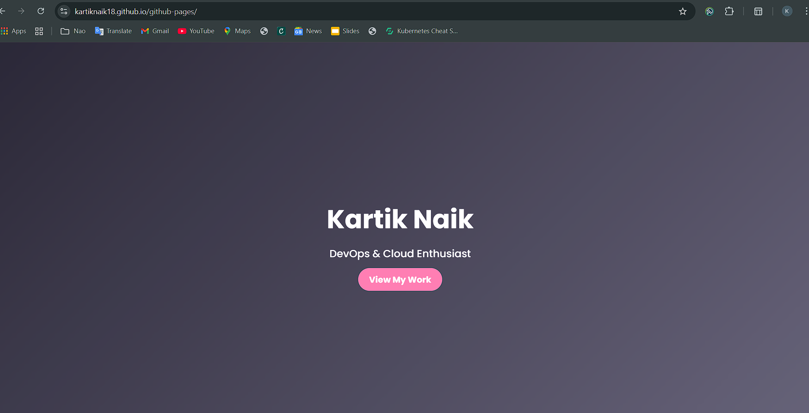
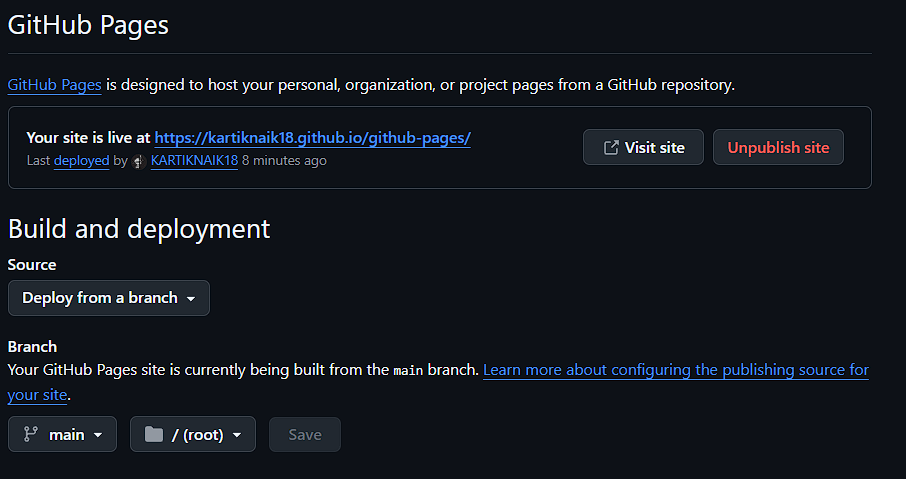
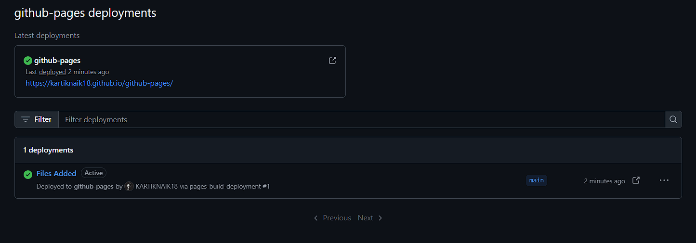

<p align="center">  </p>

# 🌐 Host Your Static Website with GitHub Pages

Create and publish a **free static website** using **HTML, CSS, and JavaScript** — all hosted directly from your GitHub repository with **GitHub Pages**.

> ✅ No servers  
> ✅ No configuration  
> ✅ Just push and publish

----------

## 🔴 Live Output

Your site is live at:

```
https://your-username.github.io/your-repository/

```

📸 **Live Website Preview**  


----------

## 📦 Project Structure

```
📁 root  
├── index.html     # Main HTML file  
├── style.css      # CSS styling  
├── script.js      # JavaScript functionality  
└── README.md      # Project documentation

```

----------

## 🛠️ How to Enable GitHub Pages

### 1️⃣ Prepare Your Repository

-   ✅ Ensure your project has an `index.html` in the root.
-   ✅ Push your code to a **public GitHub repository**.

----------

### 2️⃣ Open Repository Settings

-   Go to your repository on GitHub.
-   Click the **Settings** tab.

----------

### 3️⃣ Enable GitHub Pages

-   In the left sidebar, click **Pages**.
-   Under **Source**, choose:
    -   **Branch:** `main` (or `master`)
    -   **Folder:** `/ (root)`
-   Click **Save**.

📸  


----------

### 4️⃣ Wait for Deployment

-   GitHub will deploy your site in **30–120 seconds**.
-   A banner will appear with your site link.

📸  


----------

### 5️⃣ Access Your Website

🔗 Visit site at:


 https://kartiknaik18.github.io/github-pages/


## 📸  


## 💡 Pro Tips

🔧 Feature

💬 Description

🌍 Custom Domain

Add your own domain in the Pages settings.

🔒 Enforce HTTPS

Always enable for secure browsing.

🔄 Auto Updates

Every push to `main` updates your live site instantly.

🧪 Test Locally

Use VS Code Live Server or open `index.html` in your browser before pushing.

🖼️ Add Screenshots

Use visuals in your README to guide beginners more effectively.

----------

Let me know if you'd like to add icons, color badges, or even collapsible sections to make it more interactive.

## 📚 Resources for Beginners

-   📘 [GitHub Pages Documentation](https://docs.github.com/en/pages)
-   🧾 [Markdown Cheatsheet](https://www.markdownguide.org/cheat-sheet/)
-   💡 [HTML/CSS/JS Basics – MDN](https://developer.mozilla.org/en-US/)

----------
